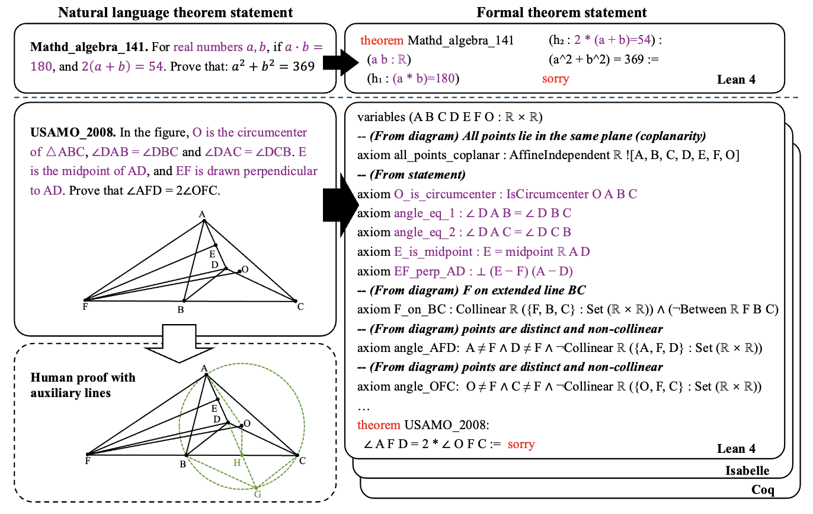
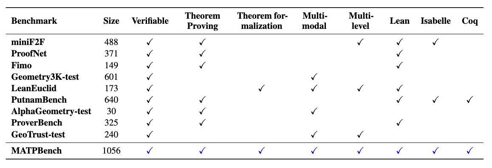

# MATP-BENCH: Can MLLM Be a Good Automated Theorem Prover for Multimodal Problems?

<b><a href="https://scholar.google.com/citations?user=ULvoYXgAAAAJ&hl=zh-CN" target="_blank">Zhitao He</a>1 <a href="https://github.com/Zhitao-He/MMBoundary" target="_blank"> Zongwei Lyu </a>1 <a href="https://zhiyuan.fan/" target="_blank"> Dazhong Chen </a>2 <a href="https://lukahhcm.github.io/" target="_blank"> Dadi Guo </a>1 <a href="https://mayrfung.github.io/" target="_blank">Yi R. (May) Fung</a>1</b>

1 HKUST &nbsp; 2  CUHK (Shenzhen)

 

---

## Introduction

Numerous theorems, such as those in geometry, are often presented in multimodal forms (e.g., diagrams). Humans benefit from visual reasoning in such settings, using diagrams to gain intuition and guide the proof process. Modern Multimodal Large Language Models (MLLMs) have demonstrated remarkable capabilities in solving a wide range of mathematical problems. However, the potential of MLLMs as Automated Theorem Provers (ATPs), specifically in the multimodal domain, remains underexplored. In this paper, we introduce the **M** ultimodal **A**utomated **T** heorem **P** roving benchmark (**MATP-Bench**), a new Multimodal, Multi-level, and Multi-language benchmark designed to evaluate MLLMs in this role as multimodal automated theorem provers. MATP-BENCH consists of 1056 multimodal theorems drawn from high school, university, and competition-level mathematics. All these multimodal problems are accompanied by formalizations in Lean 4, Coq and Isabelle, thus making the benchmark compatible with a wide range of theorem-proving frameworks. MATP-BENCH requires models to integrate sophisticated visual understanding with mastery of a broad spectrum of mathematical knowledge and rigorous symbolic reasoning to generate formal proofs. We use MATP-BENCH to evaluate a variety of advanced multimodal language models. Existing methods can only solve a limited number of the MATP-BENCH problems, indicating that this benchmark poses an open challenge for research on automated theorem proving.

---

<h3> Differences between traditional ATP and MATP </h3>

We illustrate the differences between traditional **ATP and MATP** through examples from miniF2F (above) and MATPBench (below). Multimodal theorems consist of an image paired with a natural language theorem statement, which complement each other to convey complete theorem information. Furthermore, additional auxiliary constructions are often essential for their proof (as shown in the bottom left subfigure). In traditional ATP, theorem formalization relies solely on textual statements (we use `purple` to indicate premises derived from the original statement), whereas MATP requires the model to extract critical premises not explicitly expressed in the text by analyzing accompanying diagrams (see **_From diagram_** on the right). We provide formalized versions of all multimodal theorems in Lean4, Coq, and Isabelle.

---

<h3> Benchmark Comparison </h3>

MATP-BENCH is a Multimodal, Multi-level, and Multi-language benchmark designed to evaluate MLLMs as automated theorem provers. The problems in MATP-BENCH span three distinct educational stages—high school, university, and competitions—systematically covering a wide range of difficulty levels from elementary to advanced. we manually annotate the formal statements of each problem in three formal languages. Moreover, the multimodal theorems in MATP-BENCH are primarily centered around the domain of geometry, spanning plane geometry, 3D geometry, analytic geometry.

